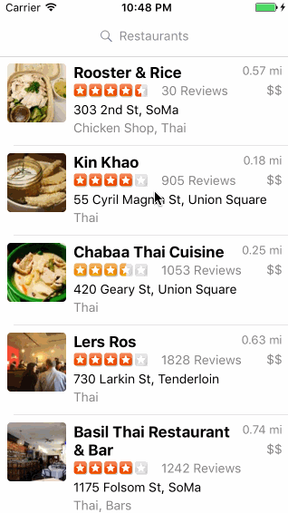
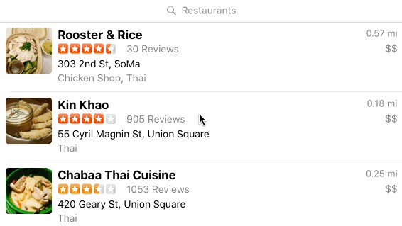

# Restaurant App

An iOS application in Swift to allow users to search for restaurants based on their given locations.

## User Stories

The following functionality is completed:

- [x] Table rows for search results are dynamic height according to the content height.
- [x] Custom cells have the proper Auto Layout constraints.
- [x] Search bar is in the navigation bar.

The following features are implemented:

- [x] Search results page
   - [x] Infinite scroll for restaurant results.
   - [x] Implement map view of restaurant results.
- [x] Implement the restaurant detail page.

The following features are implemented:

- [x] Keybaord dismiss on scroll
- [x] App icon

## Video Walkthrough 

Here's a walkthrough of implemented user stories:

GIF created with [LiceCap](http://www.cockos.com/licecap/).

## License

    Copyright [2017] [Yinrong Liang]

    Licensed under the Apache License, Version 2.0 (the "License");
    you may not use this file except in compliance with the License.
    You may obtain a copy of the License at

        http://www.apache.org/licenses/LICENSE-2.0

    Unless required by applicable law or agreed to in writing, software
    distributed under the License is distributed on an "AS IS" BASIS,
    WITHOUT WARRANTIES OR CONDITIONS OF ANY KIND, either express or implied.
    See the License for the specific language governing permissions and
    limitations under the License.
